# shoppingMall-VUE

> 一个基于 **<abbr title="Hyper Text Markup Language">vue2.5 + egg.js + mongodb + vant </abbr>** 的电商webapp网站


## 声明
>目前代码项目还在不断完善中，本项目所用到的ui组件是[有赞](https://github.com/youzan/vant)，前后端完全分离，后端只提供接口，后端代码写的比较简单，适合新手学习，这差不多是一个完整的电商网站流程，只是比较简单，非常适合新手学习研究，后续代码会慢慢更新，欢迎交流，欢迎Issues。
注：部分商品可能没有图片，使用了网络图片代替。

## 技术栈

> **vue2.5+vuex+vue-router+axios+better-scroll+stylus+localStorage+egg+mongoose+vant**


## 项目说明

本项目采用前后端完全分离模式，后端提供接口，前端渲染数据,主目录下的 **<abbr title="Hyper Text Markup Language">vue</abbr>** 目录是前端目录，**<abbr title="Hyper Text Markup Language">egg</abbr>** 是后端目录
关于数据库问题，项目采用 **<abbr title="Hyper Text Markup Language">mongodb</abbr>** 数据库，**<abbr title="Hyper Text Markup Language">mongoose</abbr>** 建模，数据库版本是**<abbr title="Hyper Text Markup Language">Mongodb4.0</abbr>**


## 运行项目步骤：

##### 1：请确保node版本在8以上，本地安装好mongodb数据库并且打开连接

##### 2：进入 egg 目录，在此目录下打开cmd窗口运行 cnpm i 安装依赖,然后 npm run dev 启动本地服务,打开http://127.0.0.1:3000  会自动把数据导入数据库,第一次运行项目需要导入打开默认导入一次（会自动把json数据导入数据库，看到控制台打印成功才能运行）

##### 3：进入 vue 目录，在此目录下打开cmd窗口运行 cnpm i 安装依赖,然后 npm run dev 启动项目

##### 4：浏览器打开 http://localhost:8090 

##### 5：项目所用到的接口在vue文件夹下src目录的Api.js里面


## 页面
- [x] 商城首页
- [x] 商品分类页
- [x] 个人中心
- [x] 商品详情
- [x] 登录 / 注册
- [x] 地址管理
- [x] 最近浏览
- [x] 我的商品收藏
- [x] 购物车
- [x] 支付页面
- [x] 全部订单


# 实现功能
- [x] 商城首页板块的查询与展示
- [x] 商品各种分类数据查询与展示
- [x] 商品详情展示
- [x] 注册 / 登录
- [x] 商品收藏和取消收藏，写入数据库
- [x] 个人地址增加修改和删除,设置默认地址等，写入数据库
- [x] 最近浏览，最多30条，本地缓存
- [x] 加入购物车
- [x] 购物车选择商品结算，数量增加、修改、删除
- [x] 订单的支付与查询
- [x] 城市选择 / 城市搜索
- [x] 商品搜索功能
- [x] 用户资料修改
- [x] egg.js重写后端
- [x] 商品评论,加图片评论
- [x] 用户头像裁剪上传更改,手机端待优化
- [x] 手机接收验证码, 手机号注册
- [ ] 添加微信和支付宝支付
- [ ] 改造成SSR渲染
- [ ] 前端页面结构优化
- [ ] 后台管理

## 项目截图
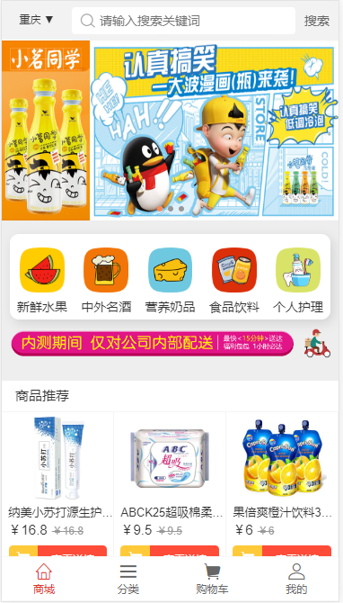
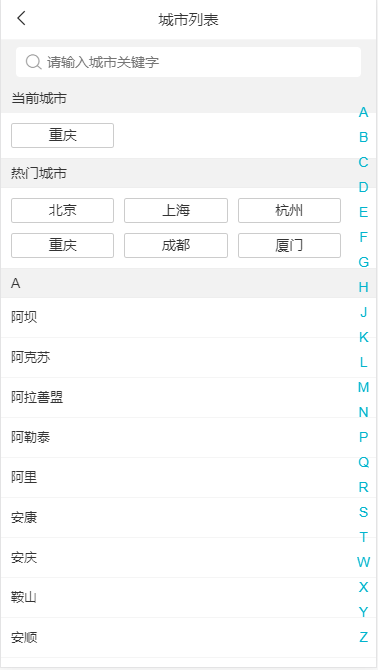
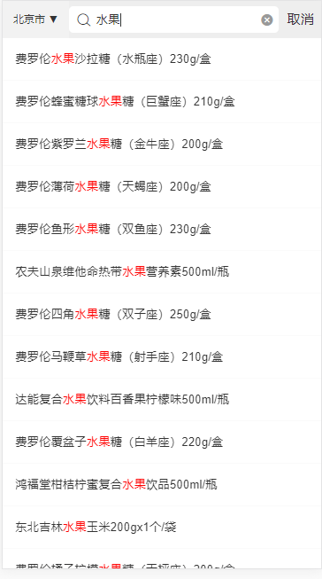
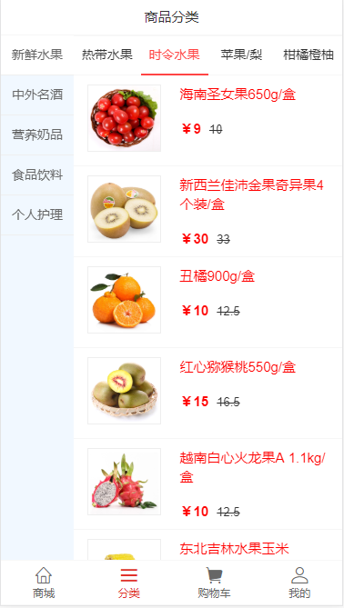
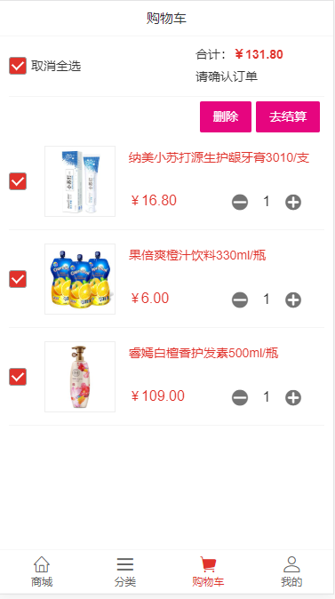

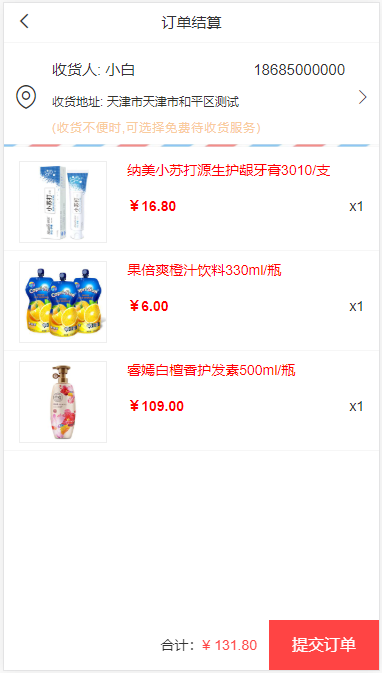
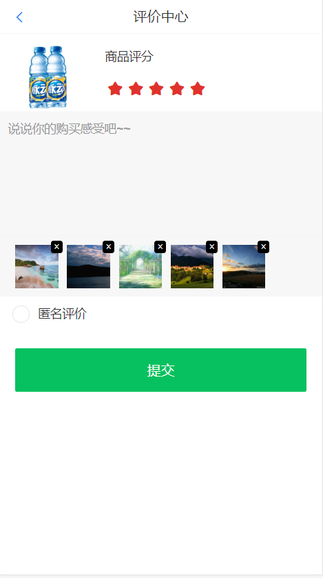
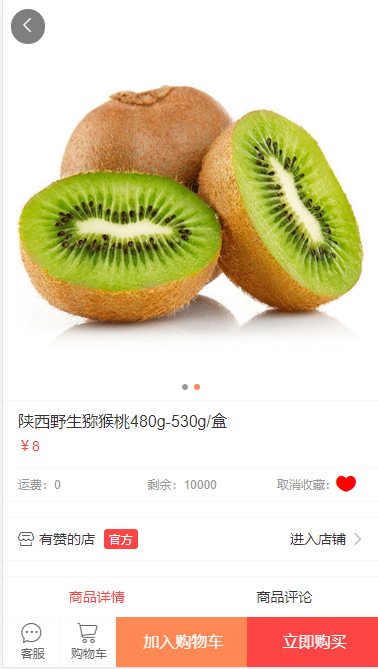
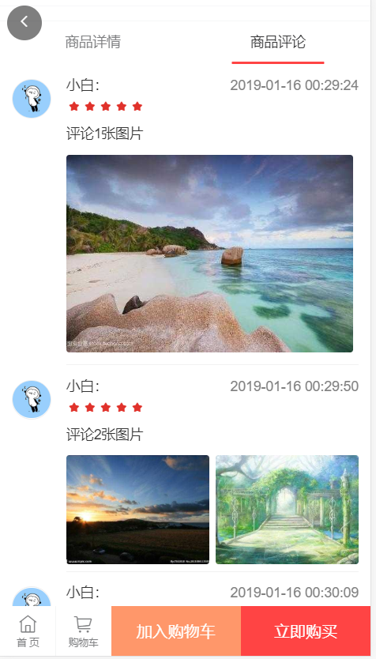
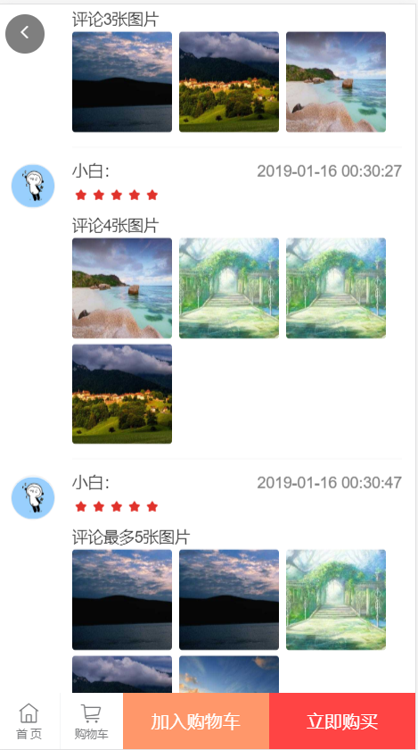

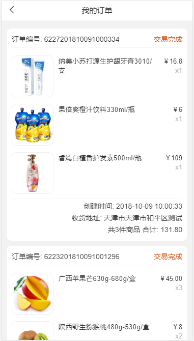
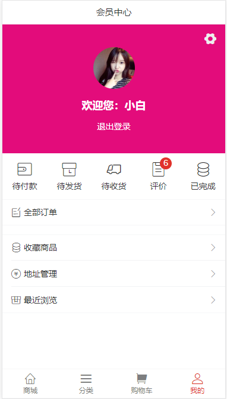
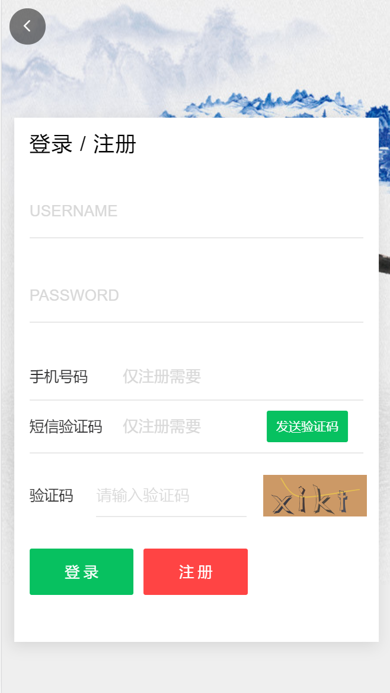


### 关于前端请求接口跨域问题，
```js
> 在前端目录vue下的vue.config.js文件下面的里加上这样一段代码，既可跨域,只适用于开发环境，3000是端口号。

devServer: {
    proxy: {
        '/api': {
            target: 'http://localhost:3000',
            ws: true,
            changeOrigin: true,  //是否跨域
            pathRewrite: {
                '^/api': ''
            }
        }
    }
    },
> 请求接口时这样写
newDetails(id) {
     axios.get(`/api/details`)
	 ....
}
```


